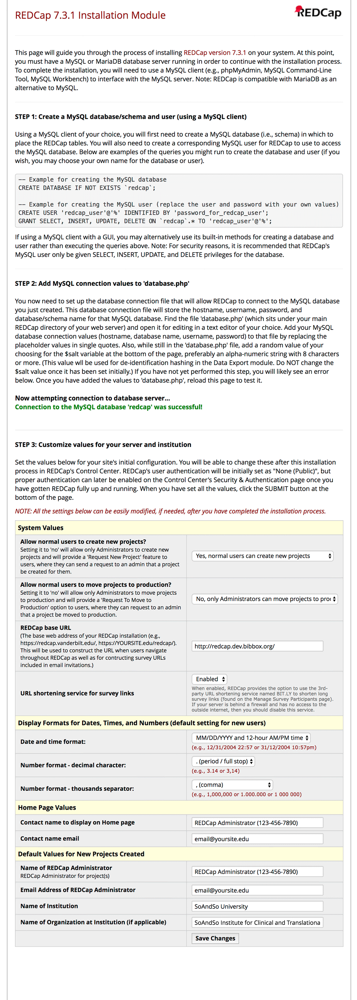
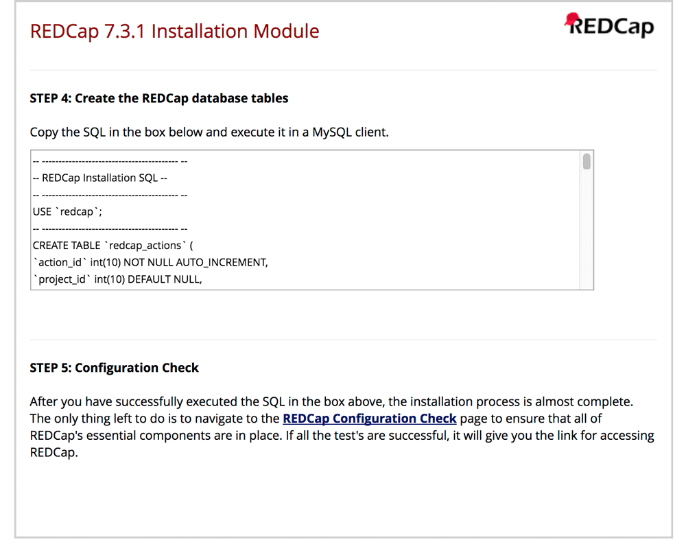
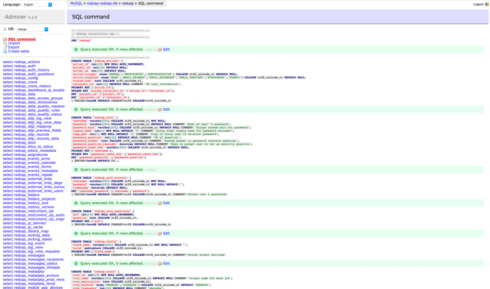
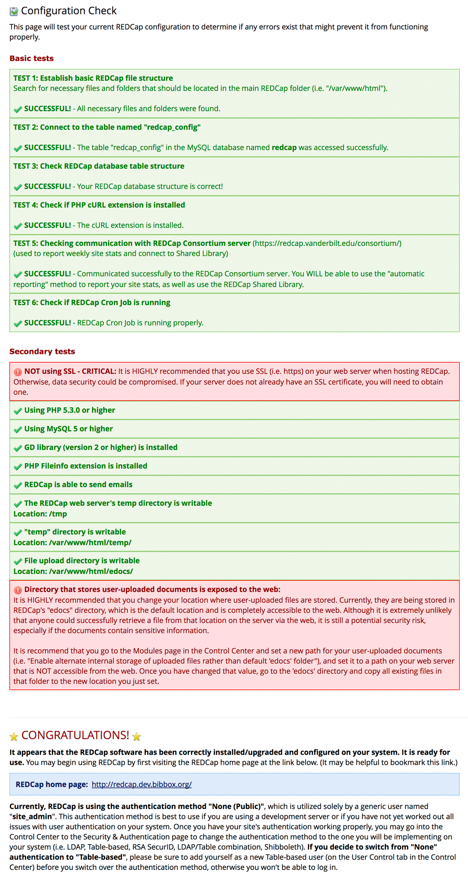
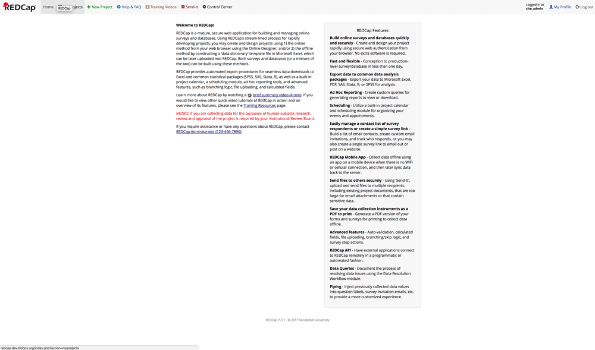

#TODO Update Instructions

## RedCap Installation Instructions

1.) Install app from store

2.) Enter the docker container from terminal with `sudo docker exec -it CONTAINER-ID bash` (Replace CONTAINER-ID with ID from redcap docker container `sudo docker ps`).

3.) Open the following files with "nano" and comment out everything, except what is mentioned here:

    # /etc/ssmtp/ssmtp.conf
    
    rewriteDomain=
    root=YOUR-ADDRESS@gmail.com
    mailhub=smtp.gmail.com:587
    hostname=smtp.gmail.com
    FromLineOverride=YES
    UseSTARTTLS=YES
    AuthUser=YOUR-ADDRESS@gmail.com
    AuthPass=YOUR-PASSWORD

and

    # /etc/ssmtp/revaliases
    
    root:YOUR-ADDRESS@gmail.com:smtp.gmail.com:587
    localusername:YOUR-ADDRESS@gmail.com:smtp.gmail.com:587

  **Make sure you replace the mail address and SMTP settings with your correct settings and save the files, then restart the RedCap app from the BIBBOX app dashboard!**

4.) Open up FileZilla or similar FTP tool and connect to your BIBBOX.

5.) Navigate to `/opt/bibbox/instances/YOUR-REDCAP-ID-app-redcap/data/html` and copy all contents of RedCap source files (`redcap7.zip/redcap/*`) to this directory via FTP.

6.) copy 'data/html/config/database.php' to 'data/html/redcap/database.php' and RESTART the instance
 
7.) Set permissions for `edocs`, `modules` and `temp` folders to 777. 

8.) Now open up the RedCap app from your BIBBOX and append `/redcap/install.php` to the URL.

9.) Follow the install instructions on the screen until you get prompted to execute some SQL commands.

10.) Open the ADMINER application YOUR-REDCAP-ID-app-redcap-adminer.YOUR-BASE-URL. (It is also listed in the )

  * Server: db
  * Username: MYSQL_USERNAME is set during installation
  * Password: MYSQL_PASSWORD is set during installation
  * Database: MYSQL_DATABASE is set during installation

11.) In Adminer or a similar database editor go to "SQL-command" and copy the SQL code from RedCap installation into the SQL field. Then execute and wait.

12.) Within the RedCap installation steps click on the configuration checker link.

13.) Most of the fields should be green now and RedCap is ready to go! Just click the **REDCap home page** link at the bottom of this page and you will be redirected to the RedCap homepage. 

14.) That's it!

## After the installation

Have a nice ride with the new Admins youngtimer.

